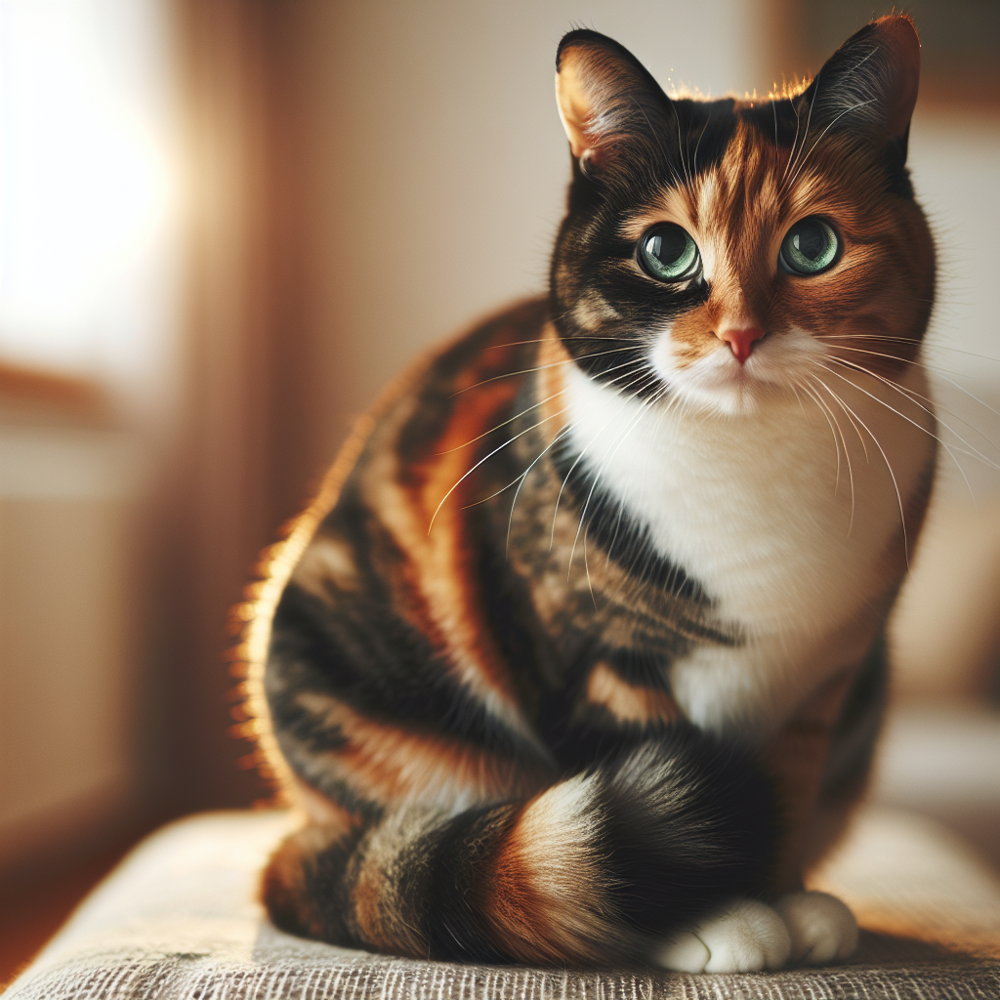

Cat

## Description of Cat:
A small domesticated carnivorous mammal with soft fur, a short snout, and retractable claws. They are often kept as pets or used for catching mice.

## Examples of Usage:
1. I have a pet cat named Whiskers.
2. The cat jumped onto the couch.

## Audio
![[audio/cat.mp3]]
## Illustration

